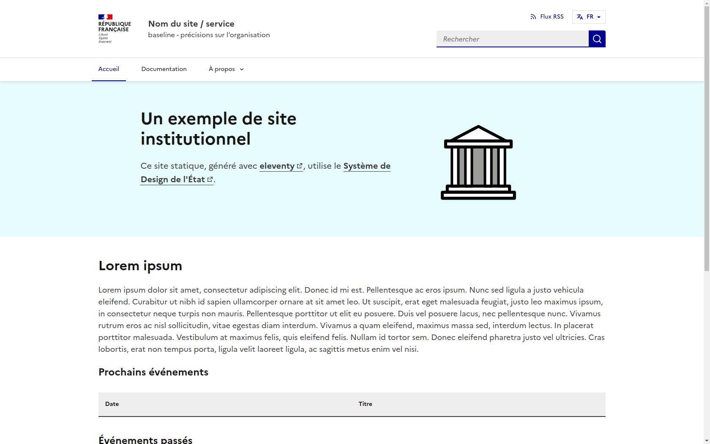

# eleventy-dsfr

Un dépôt pour démarrer un site statique au [DSFR](https://www.systeme-de-design.gouv.fr/) avec le
générateur [Eleventy](https://www.11ty.dev/).



## Fonctionnalités

- **Style** :
    - DSFR :
        - Installation et mise à jour automatique via `npm`.
        - [Voir les composants déjà implémentés](_includes/components)
    - [Voir les mises en pages déjà implémentées](_includes/layouts)
- **a11y et responsivity** : Respecte les recommandations du DSFR.
- **i18n** : Prise en charge de l'internationalisation des textes et contenus via plusieurs filtres et le [système d'i18n d'Eleventy](https://www.11ty.dev/docs/i18n/).
- **Navigation** : Utilise le [système de navigation d'Eleventy](https://www.11ty.dev/docs/plugins/navigation/) et gère la navigation de second niveau.
- **Syntaxe markdown** : Améliorée via l'ajout de [conteneurs personnalisés](./markdown-custom-containers.js).
- **Images** : Utilise l'[utilitaire d'image d'Eleventy](https://www.11ty.dev/docs/plugins/image/) pour traiter les images (par défaut pour certains composants, par exemple le composant [`card.njk`](_includes/components/card.njk)).
- **Recherche** : Utilise [pagefind](https://pagefind.app/) pour la recherche.
- **Pagination** : Utilise le [système de pagination d'Eleventy](https://www.11ty.dev/docs/pagination/) et gère la pagination de second niveau.
- **Flux RSS** : Utilise le [plugin RSS d'Eleventy](https://www.11ty.dev/docs/plugins/rss/).
- **Calendrier** : Utilise la bibliothèque [ics](https://www.npmjs.com/package/ics) pour générer un calendrier [`calendar.ics`](https://codegouvfr.github.io/eleventy-dsfr/calendar.ics) à la racine du site, à partir du fichier [`events.json`](_data/events.json) (voir aussi [son format](https://github.com/adamgibbons/ics#attributes)).
- **Mesure d'audience** : Intègre la solution [matomo](public/js/matomo.js).
- **Pages déjà générées** :
    - Pages d'accueil, À propos, section Blog (en français et en anglais).
    - Flux RSS pour Atom et JSON
    - Plan du site et `sitemap.xml`
    - Page non trouvée (404)
    - Les pages obligatoires liées aux obligations légales : “accessibilité : non/partiellement/totalement conforme”, mentions légales, données personnelles et gestion des cookies.
    
## Prise en main
### Installation

**Cloner le dépôt** :

```bash
git clone https://github.com/codegouvfr/eleventy-dsfr.git my-site-name
```

**Naviguer dans le dossier** :

```bash
cd my-site-name
```

**Installer les dépendances** :

```bash
npm install
```

**Exécuter Eleventy** :

Construire un livrable, indexé avec pagefind pour la recherche :

```bash
npm run build
```

L'exécuter sur le serveur de développement local :

```bash
npm start
```

Ou exécuter un [mode de débogage](https://www.11ty.dev/docs/debugging/).

### Réutilisation

- Modifier les fichiers [`_data/metadata.js`](_data/metadata.js) et [`_data/data.js`](_data/data.js) pour renseigner les informations du site.
- Modifier le fichier [`package.json`](package.json) pour modifier les informations du dépôt.
- Compléter les pages obligatoires : [`content/fr/accessibility`](content/fr/accessibility/index.md), [`content/fr/personal-data`](content/fr/personal-data/index.md), [`content/fr/legal`](content/fr/legal/index.md).

### Développement

- Modifier le fichier [`eleventy.config.js`](eleventy.config.js) pour configurer les paramètres d'Eleventy différemment.
- Ajouter des composants du DSFR dans le dossier [`_includes/components`](_includes/components) et des [mises en page](https://www.11ty.dev/docs/layouts/) dans le
  dossier [`_includes/layouts`](_includes/layouts).
    - Ajouter de nouveaux conteneurs markdown dans le fichier [`markdown-custom-containers.js`](markdown-custom-containers.js).

_[Voir aussi la documentation des composants](https://codegouvfr.github.io/eleventy-dsfr/fr/blog/tags/composant/)_

- Ajouter des chaînes de caractères localisées dans le dossier `_data/i18n/[lang]/index.js`.
    - Pour ajouter une nouvelle traduction, ajouter un dossier `[lang]` dans [`content`](content), un nouveau fichier `_data/i18n/[lang]/index.js` et l'inclure dans [`_data/i18n/index.js`](_data/i18n/index.js).
- Ajouter des styles personnalisés et des images dans le dossier [`public`](public).
    - Celui-ci sera copié tel quel dans le dossier de sortie. Cela signifie que `./public/css/*` persistera dans `./_site/css/*` après la construction du livrable.
- Compléter le [README](README.md) et la [documentation](content/fr/blog/posts). 😀

### Ajout de contenu

_[Voir la documentation des fonctionnalités et du Markdown](https://codegouvfr.github.io/eleventy-dsfr/fr/blog/tags/contenu/)_

### Déploiement

- Voir un [exemple de worklow de déploiement sur GitHub Pages](https://github.com/codegouvfr/eleventy-dsfr/blob/gh-pages/.github/workflows/11ty-gh-pages.yml) sur la branche `gh-pages`.

En cas d'erreur lors du build :
```bash
Error: Get Pages site failed
Error: HttpError: Not Found
```
Essayer [cette configuration](https://stackoverflow.com/a/73967433).
- _[OPTIONNEL]_ [Configurer la redirection](https://www.11ty.dev/docs/i18n/#distinct-urls-using-implied-default-language)
  de toutes les URLs des pages dont la langue est celle par défaut.

## Documentation

La suite de la documentation (composants, fonctionnalités) est disponible dans [`content/fr/blog/posts`](content/fr/blog/posts) ou directement sur le [site de démonstration](https://codegouvfr.github.io/eleventy-dsfr/fr/blog).

## Démonstration et réutilisations

- Pour une démonstration, voir la [GitHub Pages](https://codegouvfr.github.io/eleventy-dsfr/fr/) correspondante.
- `eleventy-dsfr` est utilisé pour le site [code.gouv.fr](https://code.gouv.fr).

## Licence

Le dépôt est publié sous licence MIT pour le code et sous licence
Etalab 2.0 pour les autres contenus.

Il est maintenu par la [mission logiciels libres](https://code.gouv.fr/) de la DINUM.
